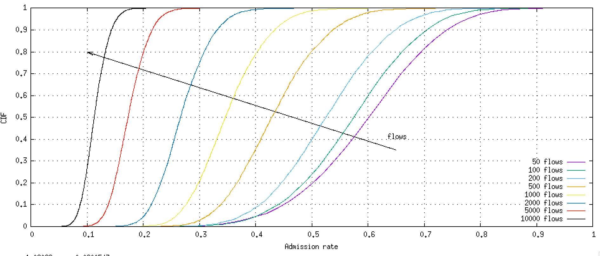

# QueeR


A quantum end-to-end entanglement routing simulator.

A C++ simulator to evaluate the performance of networks of quantum repeaters to enable end-to-end entanglement of qubits in remote nodes (e.g., for distributed/blind quantum computing, QKD, or distributed consensus).

cThe software is released as open source with a permissive MIT license (use the code, modify/share it, enjoy life and be happy).
The repository also contains several scripts to run complete simulation campaigns in selected scenarios whose results have been published in scientific paper (see Bibliography at the bottom).
The simulator uses the Boost Graph Library (BGL), which is known to be very efficient, and it is designed to be run with (many) parallel threads.

## Build instructions

Dependencies:

- cmake >= 3.2
- recent C++ compiler (GNU gcc >= 7 or LLVM clang >= 10)
- Google's glog library
- non-ancient Boost libraries

Clone repository:

```
git clone https://github.com/ccicconetti/queer.git
cd queer
git submodule update --init --recursive
```

To build without optimizations and with debug symbols:

```
mkdir debug
cd debug
cmake -DCMAKE_BUILD_TYPE=debug ../
```

To build with optimizations and without debug symbols (does not compile unit tests):

```
mkdir release
cd release
cmake -DCMAKE_BUILD_TYPE=release ../
```

To run the unit tests:

```
build/Test/testqr
```

## Execute experiments

1. build the software (see instructions), e.g., assume you build in `release/`
2. enter the experiment you want to run, e.g., `Experiments/001_Constant_Rate_PPP`
3. create a symbolic link from the corresponding executable in your build directory to the experiment directory, which can be done by running `./mklink.sh`
4. enter into the sub-experiment directory, e.g., `var-flows`
5. execute the script `./pre.sh` (if present): this will satisfy pre-run requirements, such as downloading external datasets
6. execute the script `./run.sh`: this will populate a directory called `data` with CSV output, one per batch of experiments; the meaning of the column can be retrieved by running the executable with `--explain-output`
7. execute the script `./post.sh` (if present): this will do some post-processing analysis on the results, whose output will be stored in `post`; note that you will need a valid Python2 interpreter and Internet access, which is required to download the utility Python script [percentile.py](https://raw.githubusercontent.com/ccicconetti/serverlessonedge/master/scripts/percentile.py) from GitHub. If the machine running the post-processing does not have Internet access, you may download the file and copy it into the sub-experiment directory with exec permissions
8. there may be some [Gnuplot](http://www.gnuplot.info/) scripts in the directory `graph`, you can run them by calling `gnuplot -persists SCRIPT.plt`

### Full example

Assuming you built in `release`, the following commands will create a symbolic link to the corresponding executable in (e.g.) Experiment 001:

```
cd Experiments/001_Constant_Rate_PPP
./mklink.sh
```

To obtain the data for (e.g.) the sub-experiment `var-flows`:

```
cd var-flows
./run.sh
./post.sh
```

If you have Gnuplot installed you can directly visualize the bundled plots, e.g.:

```
cd graph
gnuplot -persist admission-cdf.plt
```

The command above will show:



## Bibliography

Results obtained with the QueeR simulator have been published in the following peer-reviewed scientific papers:

- C. Cicconetti, M. Conti, and A. Passarella, _Service differentiation and fair sharing in distributed quantum computing_, Elsevier Pervasive and Mobile Computing, 2023, [Elsevier](https://doi.org/10.1016/j.pmcj.2023.101758), [BibTeX](bib/pmc2023.bib), [arXiv](https://arxiv.org/abs/2301.03977)
- C. Cicconetti, M. Conti, and A. Passarella, _Resource Allocation in Quantum Networks for Distributed Quantum Computing_, IEEE SMARTCOMP 2022,
[IEEE](https://ieeexplore.ieee.org/document/9820750), [arXiv](https://arxiv.org/abs/2203.06385), [BibTeX](bib/smartcomp2022stateless.bib)
- C. Cicconetti, M. Conti, and A. Passarella, _Quality of Service in Quantum Networks_, IEEE Network, vol. 36, no. 5, pp. 24-31, September/October 2022, [IEEE](https://ieeexplore.ieee.org/document/9964002), [arXiv](https://arxiv.org/abs/2204.09538), [BibTeX](bib/network2022.bib)